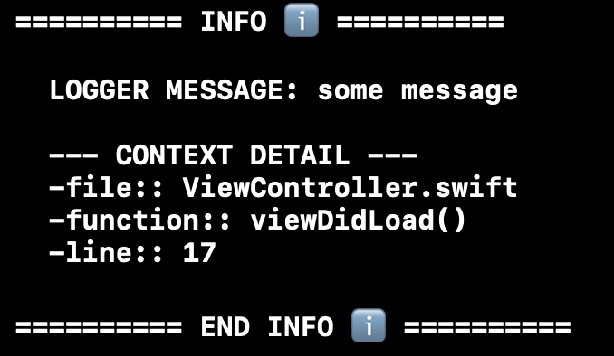
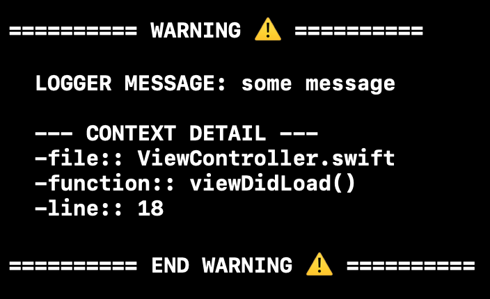
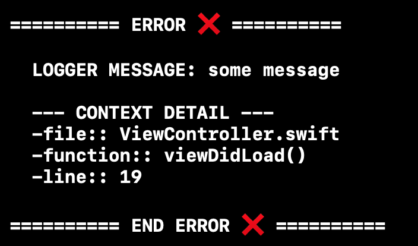
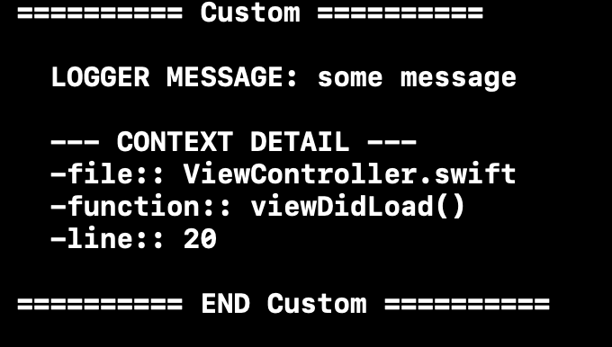
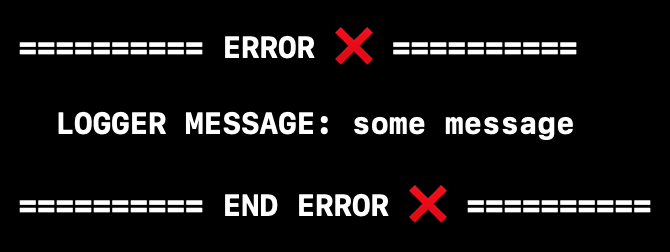

# AppLogger - Thes easyest way to Log

## _The log never lies._

Dealing with logs in iOS projects has been been a hard work when we work on big projects. There are a lot of network libraries and inbeded libraries loggin into your console, sometimes logs that you dont even want to see. 

iOS developers are used to use print as their best friend tool during a code time, but sometimes just print some random word or even a object its not enouth. sometimes we need more, a more complexy log but esyest to call as they call a print.

OBS: This is a **OpenSource** project, you can fork, give us new ideas and contibute to improve our logs.

# How App Logger Works
App Logger is built using **Swift PM**, so you easyally can embed the framework in you project. 

As we expect, we tried to find a easy way to log better, check the example above: 

```swift
import AppLogger

class Foo {
    func doSomething {
        Logger.log(level: .info, message: "some message")
    }
} 
```
### Thats all!! you don't need nothign that that!

You should may asking yourselves "OK, but how this log looks like?", I will show you in a few seconds.


# Configuration

You are able to configure how App Logger will log. For now you can chose betwen show a complete log or simplified log.
- Complete Log will show: Log Level, Message(opcional), file name, function name, line in code. 
- Simplified Log will show: Log Level, Message(opcional).
   
##### Log Levels 
``` [info, warning, error, custom] ```

#### How to chosse how App Logger will log to me ?
It's easy. You just need to set on you AppDelegate or before you invoque log methods that configuration bellow:

```swift
import AppLogger

class AppDelegate { 
    func application(_ application: UIApplication,
                     didFinishLaunchingWithOptions launchOptions: [UIApplication.LaunchOptionsKey: Any]?) -> Bool {
        setupAppLogger()
        return true
    }

    private func setupAppLogger() {
    // MARK: - App Logger shows complete log for all log levels, if you want to change some complete log to simplified log you will need to fill this array with the levels you want to show complete.
        AppLogger.logger.showContextFor(levelLogger: [.info, .warning])
    }
}
```

### How It Looks Like?









